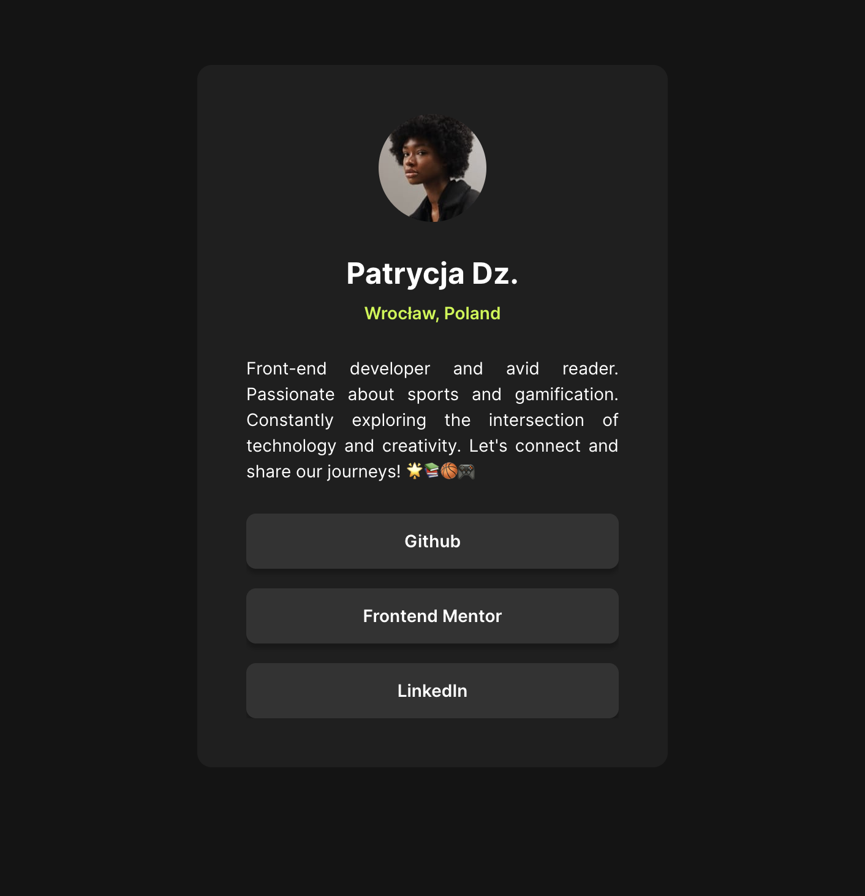

# Frontend Mentor - Social Links Profile Solution

This is a solution to the [Social Links Profile challenge on Frontend Mentor](https://www.frontendmentor.io/challenges/social-links-profile-UG32l9m6dQ). Frontend Mentor challenges help you improve your coding skills by building realistic projects.

## Table of contents

- [Overview](#overview)
  - [The Challenge](#the-challenge)
  - [Screenshot](#screenshot)
  - [Links](#links)
- [My Process](#my-process)
  - [Built With](#built-with)
  - [What I Learned](#what-i-learned)
- [Author](#author)
- [Acknowledgments](#acknowledgments)

## Overview

### The Challenge

Users should be able to:

- View a social links profile with a profile picture, name, location, bio, and social links.
- See hover and focus states for all interactive elements on the page.

### Screenshot

### Links

- Solution URL: [Solution URL ](https://github.com/Patrycja-dz/social-links-app)
- Live Site URL: [Live site URL](https://patrycja-dz.github.io/social-links-app/)

## My Process

### Built With

- Semantic HTML5 markup
- CSS custom properties
- Flexbox
- Mobile-first workflow

### What I Learned

During this project, I learned how to structure a simple HTML document and apply styles using CSS. I also practiced creating responsive designs using Flexbox and managing hover and focus states for interactive elements.

## Author

- Frontend Mentor - [@Patrycja-dz](https://www.frontendmentor.io/profile/Patrycja-dz)

## Acknowledgments

Thank you to the Frontend Mentor community for providing challenges that help improve coding skills and for the valuable feedback and support.
